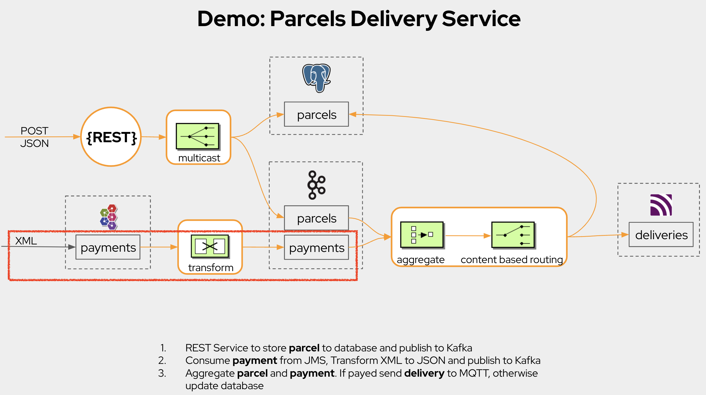

# Demo: JMS to Kafka



## Localhost
### Prerequisites

1. [VSCode](https://code.visualstudio.com/download)  installed
2. Apache Camel [Karavan](https://marketplace.visualstudio.com/items?itemName=camel-karavan.karavan) extension installed
3. [JBang](https://www.jbang.dev/download/) installed
4. Docker and Docker compose installed
5. Build Apache Artemis Docker Image
```
cd ../artemis
./prepare-docker.sh --from-release --artemis-version 2.25.0
cd _TMP_/artemis/2.25.0
docker build -f ./docker/Dockerfile-adoptopenjdk-11 -t artemis-adoptopenjdk-11 .
```
For MacOS users, in case of `tree command not found` error, install tree `brew install tree`

### Start environment
```
cd docker-compose
docker-compose up
```

### Start integration 
```
jbang -Dcamel.jbang.version=3.20.2 camel@apache/camel run *
```

### Publish payment to JMS

Open AMQ7 Broker Management [Console](http://localhost:8161)

Send message to `payments` queue
```
<?xml version="1.0" encoding="UTF-8" ?>
<root>
  <id>1</id>
  <amount>777</amount>
  <status>confirmed</status>  
</root>
```

### Browse payments from Kafka

The [kcat](https://github.com/edenhill/kcat) tool can be used to browse messages in Kafka:

```
kcat -b localhost -t payments
```

Which should output the payment that has been transformed to JSon.

```
{"id":"1","amount":"777","status":"confirmed"}
```
